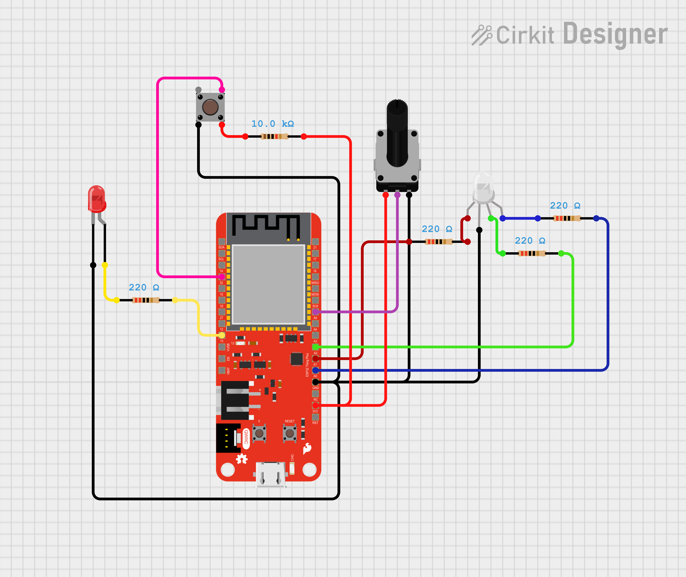
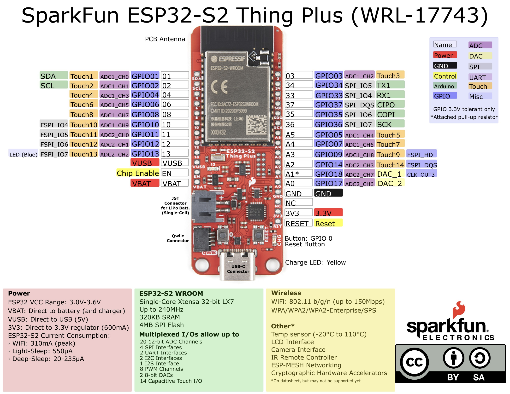

# Design for Emerging Technologies (DET), Stockholm University - Lab Session 4: Unity-Esp32 Communication

## ESP32 Instructions

### Before you start...

 - Make sure you have the [ArduinoIDE](https://www.arduino.cc/en/software) installed
 - You might need to install the CP2104 USB Driver, you can find them in this link
   - [Windows drivers](https://cdn.sparkfun.com/assets/learn_tutorials/8/5/2/CP210x_Universal_Windows_Driver.zip)
   - [Mac drivers](https://www.silabs.com/documents/public/software/Mac_OSX_VCP_Driver.zip)
    - ***Note: You might need to reboot your device after installing the drivers***
- If you face any other problems, be sure to follow the "Software Setup" section on [this guide](https://learn.sparkfun.com/tutorials/esp32-thing-plus-hookup-guide/all#software-setup)

### Once you have ArduinoIDE installed and open...

1. Install the ESP32 package by going to "Tools -> Board:"**SomeBoardName**" -> Boards Manager" and then searching for "Esp32".
      - Install the "Esp32 by Espresif" option .
2. Install the following Libraries by going to "Tools -> Manage Libraries"
   - ["WebSockets"](https://www.arduinolibraries.info/libraries/web-sockets) by Markus Sattler
   - ["WifiWebServer"](https://docs.arduino.cc/libraries/wifiwebserver/) by Khoi Hoang
   - Any other library dependencies required by the above mentioned ones if prompted to do so
3. Check if the network settings and IP address and correct. 
   - On the "ESP32_Server.ino" file, change the "ssid" and "password" variables to match your desired network credentials
4. Plug in your ESP 32 board, select the correct port and upload the code by clicking on the "Upload" button or by going to "Sketch -> Upload"
    - ***Note: if your computer does not recognize the board model automatically, you might need to specify it manually***
    - If your IDE is stuck on "Connecting to board", click on the physical "Boot/Flash" button on the ESP32 board (the one labeled with a "0")
5. Click the "Serial Monitor" button (it's on the right corner of the Arduino IDE), or go to "Tools -> Serial Monitor". Once you have that window open, click on the far right dropdown list and change it to "115200 baud"
   - Note: Don't worry if you see a lot of weird symbols such as ���, this just means that the Serial monitor is trying to display the messages from the board using the wrong Baud value
6. Click on the physical "Reset" button on the ESP32 (it is labelled with "Reset") and if your Serial Monitor window shows something along the lines of "Printing this device's details bellow...", and "Attempting to connect to **(network name)** network...", you have successfully uploaded the file to the board

### Circuit hookup guide:

In order to complete this lab, you will need the following items:

- 1x ESP32 board variant
- 1x Breadboard
- 1x Potentiometer
- 1x Button Switch
- 1x LED (any color)
- 1x RGB LED (or 3 extra LEDS with different colors)
- 1x 10k (10000) Ohm (Ω) resistor
- 4x 220 Ohm (Ω) resistor

The following sketch is an example of how you should connect each component to the ESP32 board: 

- ***Note 1: The above shown schematic is just an example and might not reflect the same pins used in the given code. Make sure you follow the appropiate schematics and change the code accordingly to fit your chosen pins!***
- ***Note 2: Make sure you connect the RGB LED and potentiometer to supported Analog Input Pins! The Button Switch and the single color LED can be connected to regular GPIO pins. Use the guides in the next images to understand where these are***

#### ESP32 Board Schematic guides provided by SU:

SparkFun Esp32 Hookup guide. For more infomation see [this link](https://learn.sparkfun.com/tutorials/esp32-thing-plus-hookup-guide/all)

SparkFun Esp32-S2 Hookup guide. For more infomation see [this link](https://learn.sparkfun.com/tutorials/esp32-s2-thing-plus-hookup-guide/all)

 ---
 Made by: António Pinheiro Braga - antonio.braga@dsv.su.se
 Code based on example provided by: [Anas Kuzechie](https://akuzechie.blogspot.com/2020/12/esp32-websocket-server.html)
